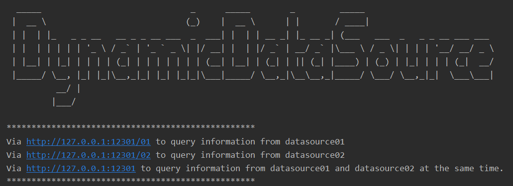

<div align="left">

</div>

# [DynamicDataSource](https://github.com/yeecode/DynamicDataSource)


DynamicDataSource是一个让你在程序运行过程中动态增删和切换数据源的工具。

---

[English Introduction](./README.md)

---

在程序运行过程中进行数据源的切换、增删是一种很常见的需求。它广泛应用在分库应用、读写分离应用、多租户应用等众多应用中。DynamicDataSource使得我们可以便捷地完成这一过程。

# 1 特点

DynamicDataSource具有以下特点：

- 小巧：只实现最基本的数据源增删、切换功能，不涉及相关业务。
- 易用：只需要简单的配置和几个方法的调用便可以完成所有功能。
- 兼容：增加数据源时，数据源信息可以来自配置文件、前端界面输入、数据库查询等各种方式。
- 无侵入：切换数据源操作可以由切面触发、逻辑触发、注解触发等，均可以供开发者自由实现。

DynamicDataSource中常用的方法有以下三个：

- `boolean addDataSource(DataSourceInfo dataSourceInfo)`：增加一个数据源
- `void delDataSource(String dataSourceName)`：删除一个数据源
- `boolean switchDataSource(String dataSourceName)`：切换到指定名称的数据源

你可以在切面、操作逻辑、注解中调用以上方法，完成数据源的动态增删与切换。

# 2 快速上手

在`\demo`文件夹下提供一个示例项目，供大家快速上手。以该demo项目为例，我们介绍DynamicDataSource的使用。

## 2.1 引入依赖包

在POM文件中引入DynamicDataSource的jar包。

```
<dependency>
    <groupId>com.github.yeecode.dynamicdatasource</groupId>
    <artifactId>DynamicDataSource</artifactId>
    <version>{最新版本}</version>
</dependency>
```

## 2.2 基本配置

在application.properties文件中写入默认的数据源信息，下面为示例。可按照自己的数据源进行修改。

```
dynamicDataSource.default.url=jdbc:{db}://{pi}:{port}/{database_name}
dynamicDataSource.default.username={username}
dynamicDataSource.default.password={password}
dynamicDataSource.default.driverClassName={dirver}
```

禁止Spring对DataSourceAutoConfiguration类的加载，否则该类会去加载固定的数据源。

```
@SpringBootApplication(exclude = {DataSourceAutoConfiguration.class})
```

增加对DynamicDataSource所在包的Bean的扫描。

```
@ComponentScan(basePackages = {"com.github.yeecode.dynamicdatasource","{other_package_root}"})
```

## 2.3 开始使用

至此，使用DynamicDataSource所需的全部配置就完成了。使用下面方式注入DynamicDataSource后便可以调用其中的数据源操作方法。

```
@Autowired
private DynamicDataSource dynamicDataSource;
```

我们可以按照`\demo\sql\DDL.md`文件所述建立两个数据源，然后测试DynamicDataSource的工作情况。

启动DynamicDataSourceDemo项目得到如下界面。



例如我们可以在一个接口内实现数据源的切换，从而在请求到达`/`接口时，先后查询了两个数据源中的数据，如代码所示。

```
@RequestMapping(value = "/")
public String queryFromDS() {
    DataSourceInfo dataSourceInfo = new DataSourceInfo("ds01",
            "com.mysql.cj.jdbc.Driver",
            "jdbc:mysql://localhost:3306/datasource01?useUnicode=true&characterEncoding=UTF-8&serverTimezone=GMT%2B8",
            "root",
            "yeecode");
    dynamicDataSource.addDataSource(dataSourceInfo);
    dynamicDataSource.switchDataSource("ds01");
    String out = userService.select();


    dataSourceInfo = new DataSourceInfo("ds02",
            "com.mysql.cj.jdbc.Driver",
            "jdbc:mysql://localhost:3306/datasource02?useUnicode=true&characterEncoding=UTF-8&serverTimezone=GMT%2B8",
            "root",
            "yeecode");
    dynamicDataSource.addDataSource(dataSourceInfo);
    dynamicDataSource.switchDataSource("ds02");
    out += "<br>";
    out += userService.select();
    return out;
}
```

可以得到下图所示的结果。下图打印的两行语句分别来自两个数据源。


数据源新增、删除、切换操作可以在切面中、业务逻辑中、注解中等各处进行触发。DynamicDataSource不做任何限制，交由开发人员按照实际需要实现。